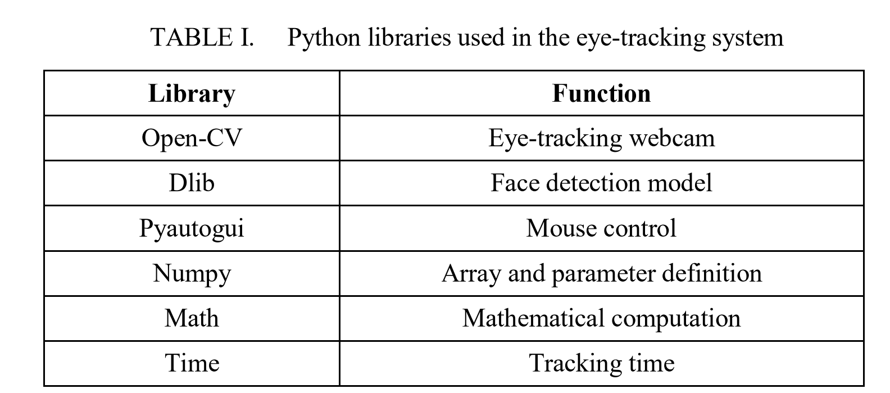
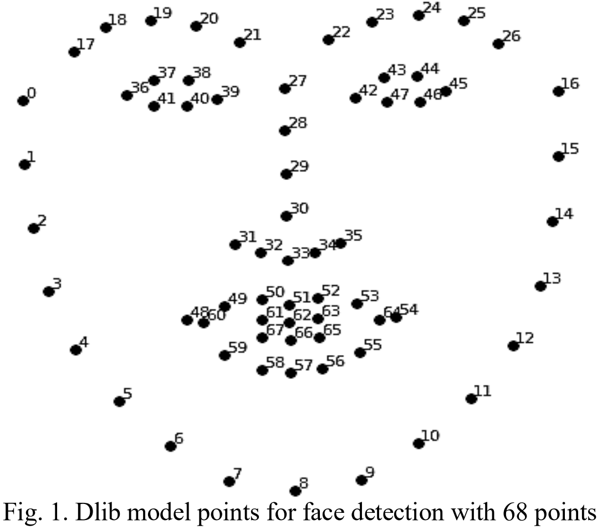

# Summary

| Date  | Notes
| :---- | :----
| 05/13 | Created SURP Progress Document, Created github repository, researched eye tracking hardware, and began looking for papers to read related to the people of interest, eye tracking, tobii hardware, and eye tracking with wheel chairs.
| 05/14 | Continued reading articles related to prior studies in utilizing eye-tracking for robotics and helping people with physical limitations, and then transitioned into reading articles that others have already written in implementing eye-tracking for helping the movement of individuals from robotics arms to wheelchairs.
| 05/15 | Finished reading articles related to eye-tracking in wheelchairs.
| 05/16 |
| 05/17 |  

# Activity
    
## Monday - 5/13

* Created a Google Doc that contains all research objectives, tasks, and goals. 
* Created Repository for SURP software and reports.
* Looked into Tobi 4c, 5, and glasses eye tracking hardware.
    * SDK appears to mainly support Python.
* Looked into articles and documents for tetraplegia which is who should be our main focus. Spinal cord injuries.
* Began looking for Research Articles on Eye-tracking in navigation, existing wheelchairs using eye tracking, and existing applications or commercilizations. 

## Tuesday 

* Read more articles on the previous research done into utilizing eye-tracking for robotics, and its applicaton in improving the range of freedom individuals with disabilities have.
* Wrote down more notes while reading research articles other have already done on eye-tracking to help people with mobility issues.

## Wednesday

* Finished reading and taking notes on articles related to eye-tracking in the development of wheelchairs.
* Began researching using a webcame and a UV mask to map a user's face and focus on the eyes

# Issues

* None as of right now

# Plans

* Continue Reading more papers but now with a focus on current applications of Eye-Tracking in robotics, navigation, and accessbility.
* Start planning out materials that may be needed to have them all by next week.

# Relevant Readings

## People of Interest

1. [Disabilities in America: ](https://www.cdc.gov/ncbddd/disabilityandhealth/infographic-disability-impacts-all.html)
    
    12.1% of individuals living in the United States have some form of mobility issues.

2. [Cerebral Palsy:](https://www.cdc.gov/ncbddd/cp/facts.html) 

    Cerebral Palsy is a type of disord that impacts an inviduals ability to move and mantain balance and posture. It is the most common motor disability in childhood. CP affects a person's ability to control his or her muscles caused by abnrormal brain development or damage to the developing brain.

    CP can vary from person to person but ranges from people not being able to walk whatsoever and needed lifelong care to midler cases where some individuals are still able to walk alebeit akwardly. CP may have problems with vision. One of the main CP that I will be focusing is Spastic Quadriplegia - the most sever form of Spastic CP and affects all four limbs, the trunk, and the face. People affliceted by it usually cannot walk and may have other developmental disabilities. 

    Next there exists Dyskinetic CP where people have problems controlling the movmetn of their hands arms, feet and legs, making it diffiuclt to sit and walk. Movements are hard, rapid, and jerky. Ataxic CP which leads to problem with coordination and balance and gives peolpe a harder time controlling their limbs.

    There is no cure for CP, but treatment can improve the lives of those who have the condition.

3. [Spinal Cord Injuries:](https://www.who.int/news-room/fact-sheets/detail/spinal-cord-injury) 

    Globally, over 15 million people are living with spinal cord injury. The term spinal cord injury (SCI) refers to damage to the spinal cord resulting from trauma or non-traumatic causes like tumors, degenerative and vascular conditions, infections, toxins or birth defects. It is associated with lower school enrolment and economic participation rates

     In paraplegia arm functions are not impacted; in tetraplegia or quadriplegia they are affected. This can decrease a person's ability to perform daily tasks like walking, using one's own hands, or other similar daily tasks. Barriers to mobility has restricted independence and their societal participation. 

     SCI tends to be a long term disability accounting for over 4.5 million years of life lived with disability.

     *Importantly, many restrictions in performing activities and participating in meaningful life areas do not result from the condition itself, but from insufficient or inadequate medical care, rehabilitation and assistive technologies access, a high economic burden, and from barriers in the physical, social and policy environments. For example, globally, only 5–35% have wheelchair access.*

     It is imperative that as SCI are a long-term disability that we provide adequate access to assistive products that eneable people to perform everyday activitities they otherwise couldn't to increase their independency and functioning.

4. [SCI .gov :](https://www.ncbi.nlm.nih.gov/books/NBK560721/?report=printable) 

    SCI occur when the axons of nerves running through the spinal cord are disrupted, leading to loss of motor and sensory function below the level of injury. Leading to varying degrees of sensory and motor function loss depending on the injury level and type. Common SCI patterns include complete transection, which causes total loss of motor and sensory functions below the injury level, and partial injuries like Central Cord and Brown-Séquard Syndromes, which affect different functions and sides of the body.

5. [Quadriplegia:](https://www.ncbi.nlm.nih.gov/mesh?Db=mesh&Cmd=DetailsSearch&Term=%22Quadriplegia%22%5BMeSH+Terms%5D) 

    The locked-in syndrome is characterized by quadriplegia in combination with cranial muscle paralysis. Consciousness is spared and the only retained voluntary motor activity may be limited eye movements. This condition is usually caused by a lesion in the upper BRAIN STEM which injures the descending cortico-spinal and cortico-bulbar tracts.

## Eye Tracking and Robotics Utilizing it

1. [Eye Trackers and Suggestions when implementing them:](https://www.boia.org/blog/creating-accessible-content-for-people-who-use-eye-tracking-devices) 

    Eye trackers typically uses a low-powered infrared light-emitting diode to illuminate the user's eye and a camera then tracks the reflections from the LED and software processes eye movements.By looking at specific parts of the screen, users can interact with on-screen keyboards, mouse simulators, and other input fields. The technology addresses many of the challenges that people with disabilities encounter

## Eye Tracking in Robotics

1. [Evalutation of Tobii EyeX for Research: ](https://link.springer.com/content/pdf/10.3758/s13428-016-0762-9.pdf)

    Tobii Claims that the system was conceived for natural eye gaze interaction and doesnt not require continoues recalibration allowing for moderate head movements. The SDK and toolkit allow for both biocular and monocular experiments and its performance is sufficient for measuring fixation parameters, saccadics, smooth pursuit and vergence eye movements. 

    However, it has relatively low sampling rate and moderate precision limit the suitability of monitoring micro-saccadic eye movements or for real-time gaze-contingent stimulus control. 
    ~~~~~~~~~~
    Realized it was Outdated
    ~~~~~~~~~~

2. [Object Detection using Eye Tracking:](https://ieeexplore.ieee.org/stamp/stamp.jsp?tp=&arnumber=8716971)

    Eye tracking technology provides a unique source of information about how humans are able to view the world. Eye tracking the intentaional view of an interested object and the intention free saccade will result in different eye movement measures which the person's intent can be inferred from.

    A user's inherent gaze offers location information which can be emplyed to locate the interested object in the scence to be recognized by the reasearchers.

    Tobii Eye Trackers 4C can only output low-level raw gaze recordings, such as 2D gaze positions and timestamps. Fixation length and fixation count are not provided in such low cost eye trackers.

    Proposing gaze-based interested ob ject detection approach using a low-cost ocnsumer-level remote eye tracker Developed framework to extract high-level eye movement merasurements from the raw gaze outputs of Tobii eye Tracker 4c with which the interested object can be detected.

    Their approach collecting gaze points and timestamps to construct gaze clusters and a vector machine classifiered to discriminate intentional gaze clusters from intention-free gaze clusters.

    Programmed in C++ for training-and-testing of these clusters. They then used their own equation to get a usersX-Y gaze coordinates on a screen at any instance in time to then construct a gaze point and place it in clusters based on certain thresholds being met (based on speed and length of gaze on specific places).

    They could then extra 3 features from these gaze clusters such as fixation length, radius of fixation and the number of time-adjacent clusters. These 3 features may help in detecting and differentiation intential gaze clusters to intention free ones.

    The performance of detecting interested objects is then evaluated by overlaying the intentional gaze clusters with the corresponding image that the user has observed, the intentional objects can be detected. They are segmented together using a normalized cut. 

    They then highlighted the performance of a visual detection method where subjects trained with SVM tasks outperformed those who did not participate in SVM training. Specifically, the correct detection rate of intentional objects using this approach is high at 98.67%, but it also has a substantial fake detection rate of 41.73%, indicating a tendency to identify fake objects as targets. This compares favorably to a state-of-the-art method using a professional GP3 eye tracker, which has lower correct (72.3%) and fake detection rates (32.2%). This demonstrates that while the new approach is more effective at recognizing targets, it is also more prone to false positives. Howver, the low cost approach that this paper focuses on says that them it is not able to provide the pupil measurements that are informative about the visual intention of an individual and may lead to the hgiher rate of fake detection.

3. [Current Robotics Exploration Using Eye-Tracking:](https://ieeexplore-ieee-org.ccl.idm.oclc.org/stamp/stamp.jsp?tp=&arnumber=9828061) 

    SCI patients are less free and thus a form of entertainment in the form of drones was proposed. It aimed to allow people with many disabilities who have limited mobility to still be able to have a sense of normality and freedom through drones.They accomplished this through an application that was able to recognize people's faces using a UV face mask that mapped the eyes based on other distinct landmarks on a person's face. It then is able to place extreme points for the eyes and a nromal computer vamera to decide where exactly one is looking at. So far, they have implement very simple commands like take off, land, and rotate. 

4. [Integrated Eye-Tracking and Motion Capture in Synchronized Gaze and Movement Analysis: ](https://ieeexplore-ieee-org.ccl.idm.oclc.org/stamp/stamp.jsp?tp=&arnumber=10304692)

    This study aimed to ecplore integrated eye-tracking and motion capture system, which can record and analyze temporally and spatially synchronized gaze and motion data during dynamic movement.

    Visual-motor coordination is a complex ability of integrating information from the visual and motor systems which can be heavily impacted by disease or disorders that influence either of these two systems. This study wants to better understand the integrative mechanism of the two systems during daily activities.

    They then mention a previous study where mobile eye trackers were used to study the gaze data of older adults in the real world; however, the coordinate system which information was collected via, was expressed in a tracker-centered coordinate system.The wearer's head movements would make the tracker-center coordinate system change which made it difficult to map the gaze data into the real world.

    Also used to study visual-motor coordinations through analyzing body movements where the position and orientation of the eye-trackedr was also measured to help synchronize gaze into the laboratory setting; however, the accuracy of this transformed data has seldom been evaluated. 

    They used a head-mounted eye-tracker (Pupil Core, Pupil Labs, Gemany) to collect the needed data from one's vision.

    This study analyzed the integrated eye-tracking and motion analysis system. This study introduced an integrated eye-tracking and motion analysis system capable of recording and analyzing gaze and motion data in real-time and space during dynamic activities. The system was evaluated for its accuracy in both static and dynamic conditions, revealing consistent tracking performance despite an increase in distance from targets.

   They also found that gaze distribution on walking paths was linked with the nature of the walking tasks, showing an adaptive strategy in participants who modified their walking speed based on the perceived risk of the terrain. Despite its potential, limitations such as small sample sizes and non-randomized task sequences suggest that further research is necessary to undestand motor and visual coordination.

5. [Eye-tracking in assisting people with physical limitations: ](https://ieeexplore-ieee-org.ccl.idm.oclc.org/stamp/stamp.jsp?tp=&arnumber=10333033)

    This study combined different types of technologies to develop a robotic platform with an eye-tracking control system to offer patients with neuromotor disabilities the ability to control a robotic arm. 

    Users use their eyes and head tracking to control the desired object while their program sends the position of the item to the robot to act. They proposed a methodology to perform control of an actuator from the eyes, organized a simulation environment to evaluate it, and perfomed simulations to determine the advantges and disadvantages of the method compared to the literature.

    Previous literature has explored using not only the eyes, but facial expressions, and voice commands to controla  robot with a limited degree of freedom from the user. Moreover, different studies have used commercially available screen-mounted eye tracker as opposed to a webcam.
    
    A different study also utilized a camera mounted to a robo to explore the learning curve required to use such a system and the behaviour of the system in processing time and movement accuracy of the robot. Infrared camera was used here that gave more precision to the cursor controlled via eyes.

    Another study then implementerd computer vision, a kinect, gaze detection, and partially autonomous guidance to control a robotic arm, which reduced brain load.

    This work aimed to enable the command of a robotic manipulator through two cameras: one webcam and another camera mounted in the ambient to assist people. They then detected user's gaze using the RT-GENE library from a webcame and extracted information provided by YOLO, a pre-trained convolutional neural network, to obtain position of the objects in the scene.

    For eye position identification and command interface they used ROS packages to establish gaze or head position and identify blinking. They also developed a graphical interface with the help of the tkinter library to identify objects in the scene.

    They then ran their simulation and gathered results in eye-tracking being utilized for the pick and place task. 
    
    Head movement does not have the problem of gaze confusion, but its detection takes a bit longer compared to eye-tracking. However, it must be an option not a requirment as the range of motion may be limtied to others.

    Some limitations that they mentioned were: the use of eye-tracking faced robustness challenges, as the system occasionally confused looking downward with closed eyes, highlighting a need for enhanced accuracy and reliability in tracking technologies. This may be able to be accomplished through a webcame or uv mask.

## Wheel Chairs and Eye-Tracking

1. [Eye-Tracking based Control of Robotic Arm and Wheelchair:](https://ieeexplore-ieee-org.ccl.idm.oclc.org/stamp/stamp.jsp?tp=&arnumber=10412408)

    Machine and deep learnign methods have been widely applied with robotics and eye tracking. However, many of these methods require the head of a user to be still or utilized LED/Glasses which may be uncomfortable for users. Moreover, their is a precise calibrator that may be typical in these systems.

    This paper aims to develop a system that utilizes a standard laptop webcame for eye tracking, enabling control of a robotic arm, and wheelchair through a GUI.

    They implement a series of blinks for typing and controlling a smart wheel chair. However, this implementation of the wheelchair is equipped with an ultrasonic sensors to detect obstacles and halt movement for user safety. (said to be cost-effective).

    Below you can find the python libraries they implemented.

    

    They have two main sections a deep learning model for eye detection and mouse cursor control. They used a Dlib model with 68 points to map the face to map the human eyes and get their coordinates.

    

    They then transform the images of the iris and cornea to gray-scale to separate the two and ease the process of tracking the eyes. They then draw a line and count the number of pixels on each side of the drawn line to decide what area a user's eye is in (Left, Right, or Center). Similar logic is used for Up and Down eye movement. 

    For detecting blinking we map 6 points to a user's eye and determining the height of their pupil allows us to know if someone is blinking.

    They then explain the robotic arm portion of their research, and their development of a smart wheel chair with eye-tracking. They utilized a system using a webcam, custom image processing software (developed in python), and Open-CV to determine the direction of eye movements. Ultrasonic sensors are used tangently to prevent obstacle collision.

    A limitation that they mention in their study is that lighting conditions in the environment can heavily impact the accuracy of their system. They suggest implementing a higher-resolution camera.

    Contains blinking equation that may be useful.

2. [Eye-Controlled Wheelchair Using a Raspberry PI ](https://deliverypdf.ssrn.com/delivery.php?ID=582114003071119097097001093029116081029032054004040066067031091028071098106091014096122097062099041113051097029090117065115102126050004093022007023103089066093001019002077080118067100068024003023105108082109127107099109008015024025109070110092085124111&EXT=pdf&INDEX=TRUE)

    At present there are already different methods that are used to control wheel chairs like the eyeball method based on EOG, ECG, and EEG. The head movement system, a voice activated system, infrared reflection, and much more. This paper says that these are all limited in their own unique ways like being interfered with by the lighting or sound in an enviornment or being inaccessible for a certain demographic of people.

    OpenCV library is used in a lot of these examples to recognize faces and eyes. 

    This study utilized a raspberry pi board to control the entier system. THey used a camera to take pictures which is then transformed into an output signal that is analyzed by the Raspberry Pi which sends appropriate control signals to the motor drive. This system is fully independent and all modules work independlty from one another.

    Software used: Putty to connect the desktop to the Raspberry pi, OpenCV to fix computer vision problems, python for fast applications, and numpy for scientific calculations.

    The principle of their system revoled around eye tracking, movement, and blinking of the eyes.

    In this system blinking applies to starting and stopping wheelchair systems.

3. [Eye-Gaze Control of a WheelChair mounted 6Dof assistive robot for activties of daily living:](/Reports/Images/s12984-021-00969-2.pdf)

    This study developed a control architecture for an eye-gaze control of a wheelchair-mounted assistive robot for activities of daily living for individuals with upper limb impairment. They used a graphical interface with virtual buttons to control wheelchair and wheelchair mounted 6DoF robotics arms in cartesian mode. In their control, they addded a feature to load the predefined path of the robot's end-effecto to perform an activity of daily living repetivively, such as a feeding task.
    
     It is imperative to increase attention on mobility assistance to improve the independence of those individuals and, therefore, reduce the burden of care for the family.

    Other related assistive technologies in related works include: powered wheelchairs, posthetic limbs, functional electrical stimulation, and wearable exoskeletons. An example of one of these assistive technologies is an eye-tracking-based telerobotic arm system proposed for tele-writing and drawing. 

    This study utilized a powered wheelchair and a tobii PCEye5 for eye-tracking. They then presented their kinematics/mathematical formula for their coordinate transformation in the 3D space.

    The control system for the eye-gaze controlled robot uses three connected control loops: Current, speed, and position. It uses these loops to manage its own movements. The innermost current loop adjusts motor torque to influence speed using a Proportional-Integral controller to increase the motors' accuracy. The speed loop, also using a PI controller, corrects the robot's speed based on real time feedback, while the outermost position loop uses proportional control to minimize positional errors. These loops all work together in real-time to ensure successful gaze tracking.

    They then used python integrated with multithreading to allow for sending commands from virtual buttons to the controller simultaneously. They used a microsoft surface pro and tobii PCEye 5 hardware for their eye-tracking. They originally used a system with a user interface but too many issues arose from it like too many buttons, small button size for triggering with eye gaze control, and the interface's complexity. They then reworked it to make it more digestible and easier to use.

    Their user interface has two modes one for the arm and another for the wheelchair. It was reworked to have larger buttons to allow ease of access as the eye-tracking was prone to errors with smaller buttons. The arm page as seen in the figure belowed labeled 7 shows the different buttons users have to control their robot accurately. Moreover, their wheelchair support via the eye-tracking also follows much of the same design with only its funtionality slightly shifting since as long as a user is eyeing one of the buttons the robot will continue moving in the directed direction. Furthermore, they also a mode called Cartesian mode that allows for manual operation of the robotic arm with the buttons controlling the arm in XYZ axis and openning and closing the gripper. 

    

    They then ran human trials and shared their results. Their study yielded ten samples from 10 participants from 3 types of tasks. The 10 particpants overall had a positive experience; however, the time spent for each person on each task is particularly notable as picking up an object from a table only has a minimum time of 46 seconds.

    To make this control system more efficient and user-friendly they plan to add object detection with the help from computer vision will which will aid the user in manipulating objects. Their goals include decreasing task completion time.

4. [An intelligent and Low-Cost Eye-Tracking System for Motorized Wheelchair control](https://www.ncbi.nlm.nih.gov/pmc/articles/PMC7412002/pdf/sensors-20-03936.pdf)

    In this study they proposed a wheelchair controlled through a user's eye via gaze detection. To process images and estimate gaze direction and move the wheelchair as necessary they implemented four user-specific methods (3 of out the four are based on a benchamark database created by the authors and one of which utilized a convolutional neural network). Their system is comprimised of two subsystems: sensor sybsystem and intelligent signal processing, and decision-making and wheelchair control. For the wheelchair they utilized ultrasonic sensors to prevent unwanted collisions and replaced the joystick control in an existing wheelchair with signals from an eye-tracker. 

    Generally, two methods for eye-tracking: video-based systems (consits of a camera at a distance to the user or head mounted and a computer for data processing but it is limited in eye detection) and Electrooculography(EOG)-based system (very robust technique for measuring saccadic eye movement associated with gaze shifts and detecting blinks. Contrary to video-based eye-trackers, EOG allows recording of eye movements even with eyes closed).

    There have been many different implementions using multiple different techniques to serve wheel chair systems: like using an IR camera with LEDS to process data and allow for gaze detection, using a head-mounted camera and Gaussian filtering to remove noise from an image and moving relative to iris position (starting and stopping by blinking for 2 seconds), and Raspberry pi implemention.

    An EOG is a camera-independent method for gaze tracking and generally rewquire slower response time and operating power than the video-based methods.  It involves having electrodes being places on the skin at tidfferent positions around the eyes having the eye modeled as an electric dipole. When the eye is in a steady electic potentional, but when movement occurs there is a change in the electric corneal-retinal potential that can be measured.

    In EOG implementations a microcontroller was used to identitfy target point direction and was cost effective, independent from changing light conditions, and containing lightweight signal processing. However, limited because of the nodes and did not respond effectively for oblique rotation of the eye. Moreover, I personally believe it is inefficient as assisitve tech because the node placement would require the assistance of a thid party every single time a user wishes to use it.

    CNN implemenation has been explored using large datasets and found that FPS should not be less than 20-25 otherwise error would increase. Another CNN classified images of eyes into 7 categories.

    Considering the pros-and-cons of the previous works, they propose an eye-controlled wheelchair system running at real-time (30 FPS) using CNNs for eye gaze classification, and made up of several low-cost, lightweight controller subsystems for wheelchair. The system takes the input images from an IR camera attached to a simple headset, providing comfort and convenient movement control to the user with complete free-eye movement.

    Their implementation was similar to works above using ultrasonic sensors and an electric wheelchair. They used IR cameras becauses similar images under different lighting conditions and did not bother users.

    They utilize a gaze estimation system in their electric wheelchair, by using algorithms that require initial user-specific training. These algorithms utilized eye-tracking to interpret user commands, enabling movements like forward, right, and left - using eye winks to start and stop wheelchair motion abd making it so users must face the screen direction to input commands.

    Another template matching method in gaze estimation used a simplified approach where only the pupil is used as the template, extracted during a calibration phase when the user gazes forward. This method optimizes for the constant visibility of the pupil across different gaze directions, unlike the iris, which may not fully appear when gazing side to side. The correlation process involves sliding the pupil template across new images to find the best match in any pupil position, offering improvements over previous methods by reducing the number of correlations needed per image and expanding the capability to detect the pupil in various positions beyond basic left, right, or forward gazes.

    Additionally, a feature-based template matching technique utilizes Local Binary Patterns to analyze image textures by a pixel basis within a 3x3 cell around each pixel. This method subtracts the center pixel value from its neighbors, assigning a binary code based on whether the result is above a threshold, which effectively captures local texture variations. This technique eliminates the need for equalizing the histogram.

    In the study, Convolutional Neural Networks (CNNs) are utilized to classify gaze directions effectively, adhering to a user-specific approach. This meant training a new dataset that was user specific taking around 5 minutes with 30 frames per second. The resultant CNN classifier is optimized for real-time eye according to the user's gaze direction ensuring both speed and accuracy in operation.

    CNN was selected as network model as it utilizes feature extraction and classification into a unified learner allowing CNN ot learn on raw data (eliminating manual feature extraction) and it goes hand in hand with user specificity because it'll learn featurses from each individual user. 
    
    CNNs are simply feedforward artificial neural networks (ANNs) with two constrainst: neurons in same filter only connected to local patches of the image to preserve spatial structure and their weights are shared to reduce the total number of model's paramters. 

    CNN consits of three building blocks: convolution layer to learn featues, pooling (subsampling) layer to reduce the dimensionality the activation maps, and a fully-connected layer to equp the netowrk with classification capabilities. 

    Before feeding images to entowrk images were decimated to 64x64 images to reduce time for classification. they were then zero-centered

    The CNN used for gaze estimation is trained using resized and normalized 64x64 images to speed up real-time classification. It uses Mean Squared Error and adaptive Stochastic Gradient Descent for efficient parameter optimization. To enhance accuracy and prevent overfitting, five-fold cross-validation divides the dataset for robust tuning and testing, ensuring the model's reliability.

    Built own database because public ones didn't fit what they were looking for.

    Their ultrasonic sensor worked by sending a ping outwards and receiving an echo, and based on the traveling time and speed of the ultrasonic wave they would be able to calculate how far they were from an obstacle. They then were able to decide whether the wheelchair would have to stop.

    They mention collecting a variety of data from a variety of light sources in order to combat the fact that the iris shrinks when exposed to bright light and the eyelids tending to close.
    
    During the calibration phase, template matching corrects user response delays and blinks, ensuring accurate gaze data collection across multiple scenarios. This process gathers 600 frames per class under varied lighting and gaze conditions, resulting in a robust and well-labeled training dataset for the CNN.

    During calibration if our template matching gets over 80% accuracy, we are good to continue with this dataset.However, if it isn't met, a new template may be chosen for re-testing since low accuracy suggests the user might have gazed in the wrong direction or blinked multiple times. If this happens we will restart the data collection process. After achieving the desired accuracy, the data is refined to remove anomalies (blinking) and used to train the CNN, to be used for the eye-tracking wheelchair steering.

    [Flowchart of Real-time Classification of Wheelchair](./Images/4.png)

    In their analysis they found that the system performs backpropagation in approximately 19.7 ms per iteration, for a max training time of about 1.97 minutes for 100 iterations in a set of 60. The system also achieves a forward pass latency of about 1.57 ms per image, significantly outpacing real-time requirements with an actual frame rate of roughly 99 fps. Moreover, they used a Softmax block to map the 3-D class scores vector representetive of the model's confidence level for a particular class for different images.

    Five-fold cross-validation was performed to obtain precise classification accuracy (i.e., the ratio of the number of correctly classified patterns to the total number of patterns classified) They created 5 confusion matrixes which all had a score above 96.875% showing the satisfactory ability of this system.

    In the future they want to explore more classifications for more degrees of freedom for movement.

5. [Eye-Controlled Wheelchair:](https://ieeexplore.ieee.org/document/7147553)

    Important to underlay a live feed image of where they are going for users to be aware of their updating movement.

    Their proposed design for an eye-controlled electric powered wheelchair mirrors the mobility of a standard joystick-powered model but through eye commands. The wheelchair features a laptop screen and a mounted eye-tracker, allowing users to direct movement and navigate using visual commands on the screen (which displays a real time footage of the updated environment)

    Their implementation handles flat and bumpy terrain due to their six wheel design and suspension system. The interface is not limited by the time of day with a LCD screen and infra-red eye tracking.

    Hardware has to be able to observe the surrounding environemnt and send the needed data to a computer which will run software to analyze data and make a decision to direct the wheelchair's movement.

    Through their infrared eye-tracker users have to go through a set calibration program. After calibration, and users give data via the eye-tracker LABVIEW allows this data to be translaterd into ouput voltages that indicate desired movement diretions.

    In the old joystick system, the amount of voltage that would be sent was proportional to the strength and movement of the joystick itself. The laptop then send signal thorugh the port where the joystick once was, allowing desired movement.

    The LabVIEW component for controlling the eye-directed electric wheelchair is structured into four modules. The Eye Tracker Initializer module which launches and calibrates the eye tracker, minimizing unnecessary windows and recording gaze data to text files. 
    
    The Webcam Initializer powers up the webcam, sets up a video stream on the laptop, and defines visual command structures for navigation.
    
    The Coordinate Reader and Data Delay module, gaze data is processed at intervals to prevent unintended commands, converting XY coordinates to numerical values for logical operations. 
    
    Finally, the Logic Operators and DAQ Voltage Generators module interprets these coordinates to allow movement when desired.

    To avoid accidental input they required users to mantain contact with a desired button for 15 seconds. [this seems a bit excessive]

    A limitation that they mentioned was how the current system requires the user to be able to understand and run LabVIEW (open and run it themselves)

    They conclude wheelchair control through the use of an eye-tracker is possible and has been achieved.

------------------------

# Lit Review Reflection

- What similar work exists?
    - There is already a lot of research that has been done in using eye trackers in order to help develop assistive technology. 
    
    It has taken on the forms of gaze controlled robotic arms, gaze detected drones, and even eye-tracking based wheelchairs. A lot of these implementations used a variety of tools like IR cameras, computer cameras, and commerical eye-tracking devices to gather data about ones eyes. I noticed that multiple of these implementations tend to use the same interface where robots are controlled via an overlayed live-feed of the real world. Moreover, they tend to implement other sensors to prevent unwanted collisions.

- What worked or did not work?
    - Using IR or more commercial eye-trackers although more expensive tended to allow for lighting to play less of an impactful role which is necessary as we want to ensure assisitive technology is able to work in all types of environments.
    - An EOG based system although more accurate in all types of conditions doesn't seem as effective since it requires further assistance from a third-party for application of the nodes/electrodes to even let it function as intended.
    - Authors noted that some software needed for the wheelchair to function was not accessible and required knowledge on the application in order to fully utilize it. 
    - Training models based on individuals increased accuracy heavily; however, also led to an increase in time spent having to do so. 
    - Using a UV makes with adlib seems effective for tracking via facial landarms the location of the eyes to then calculate where someone may be facing and the direction of their head.
    - They tend to use wheelchairs that use electric joystick to manuever but replace the joystick with a computer that based on one's gaze decides what voltage should be sent.

- What can I add?
    - Explore more of the AI usage to decrease the mental workload required for navigating the world.  
    - Explore utilizing the computer webcam as oppsosed to just the eye tracker.
    - Explore different ways of movement.
        - Maybe something similar to "map desired path" and then allow us to try to follow that direction as proposed.
    - Make it easier to digest and work as a third-party
    - Walking in a crowd of people
        - Have to be able to stop, and still navigate to a place around people.